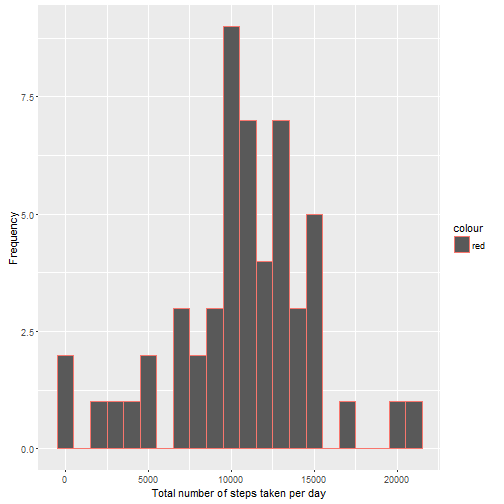
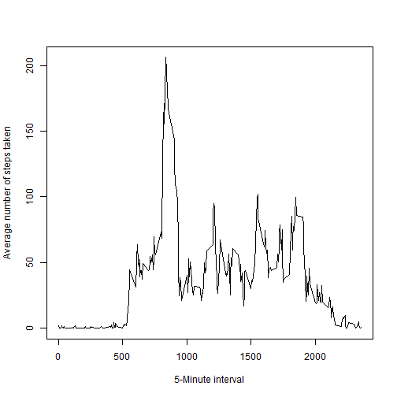
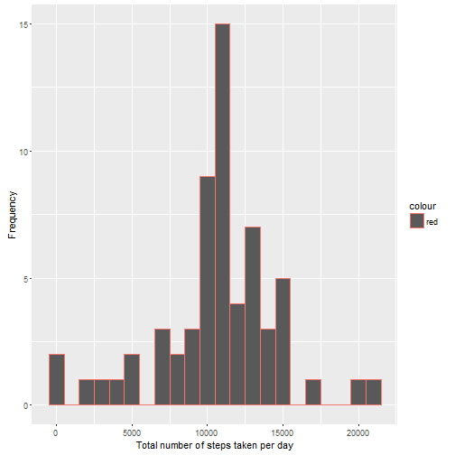

#Reproducible Research: Peer Assessment 1

This assignment makes use of data from a personal activity monitoring device. This device collects data at 5 minute intervals through out the day. The data consists of two months of data from an anonymous individual collected during the months of October and November, 2012 and include the number of steps taken in 5 minute intervals each day.


```r
library("knitr")
opts_chunk$set(echo=TRUE)
```
##Loading and preprocessing the data


```r
data <- read.csv("activity.csv");
```

Use **unzip(zipfile = "activity.zip")** if necessary.

## What is mean total number of steps taken per day?


```r
library(ggplot2)
totalstepsmade <- tapply(data$steps, data$date, FUN=sum)
qplot(totalstepsmade, binwidth=1000, xlab="Total number of steps taken per day", ylab="Frequency", color="red")
```

```
## Warning: Removed 8 rows containing non-finite values (stat_bin).
```



```r
mean(totalstepsmade, na.rm=TRUE)
```

```
## [1] 10766.19
```

```r
median(totalstepsmade, na.rm=TRUE)
```

```
## [1] 10765
```

## What is the average daily activity pattern?


```r
library(ggplot2)
averagedailyact <- aggregate(x = list(steps = data$steps), by = list(interval = data$interval), FUN = mean, na.rm = TRUE)
plot(x=averagedailyact$interval, y=averagedailyact$steps, type="l", xlab="5-Minute interval", ylab="Average number of steps taken")
```



Which 5-minute interval, on average across all the days in the dataset, contains the maximum number of steps?


```r
averagedailyact[which.max(averagedailyact$steps), c(1,2)]
```

```
##     interval    steps
## 104      835 206.1698
```
The 5-minute time interval of the day with the highest average number of steps is from 8:35 AM to 8:40 AM, at 206.2 steps.

## Imputing missing values

Note that there are a number of days/intervals where there are missing values (coded as NA). The presence of missing days may introduce bias into some calculations or summaries of the data.

1. The total number of missing values in the dataset (i.e. the total number of rows with NAs)


```r
nrow(data[is.na(data$steps),])
```

```
## [1] 2304
```

2. Devising a strategy for filling in all of the missing values in the dataset, one can use the mean for that 5-minute interval.


```r
fillNA <- function(steps, interval) {
    f <- NA
    if (!is.na(steps)) 
        f <- c(steps) else f <- (averagedailyact[averagedailyact$interval == interval, "steps"])
    return(f)
}
```

3. Create a new dataset that is equal to the original dataset but with the missing data filled in.


```r
upddata <- data
upddata$steps <- mapply(fillNA, upddata$steps, upddata$interval)
```

4. A histogram of the total number of steps taken each day


```r
totalstepsmadeupd <- tapply(upddata$steps, upddata$date, FUN = sum)
qplot(totalstepsmadeupd, binwidth=1000, xlab="Total number of steps taken per day", ylab="Frequency", color="red")
```



The mean and median total number of steps taken per day


```r
mean(totalstepsmadeupd)
```

```
## [1] 10766.19
```

```r
median(totalstepsmadeupd)
```

```
## [1] 10766.19
```

Mean value didn't change comparing to the original data, but median has slightly shifted. 
Using the mean for that 5-minute interval has a very small impact on mean and median values. Median value is now equal to the mean value because there are many days with steps sum equal to the mean.

## Are there differences in activity patterns between weekdays and weekends?

A new factor variable in the dataset with two levels - "weekday" and "weekend" indicating whether a given date is a weekday or weekend day has to be created. In this part, we use the dataset with the filled-in values.


```r
weekday_end <- function(date) {
    day <- weekdays(date)
    if (day %in% c("Monday", "Tuesday", "Wednesday", "Thursday", "Friday")) 
        return("weekday") 
    else if (day %in% c("Saturday", "Sunday")) 
        return("weekend") 
    else stop("Ops! something went wrong")
}
upddata$date <- as.Date(upddata$date)
upddata$day <- sapply(upddata$date, FUN = weekday_end)
```

A panel plot containing a time series plot of the 5-minute interval (x-axis) and the average number of steps taken, averaged across all weekday days or weekend days (y-axis).


```r
averagedailyact <- aggregate(steps ~ interval + day, data = upddata, mean)
ggplot(averagedailyact, aes(interval, steps)) + geom_line() + facet_grid(day ~ .) + 
    xlab("5-minute interval") + ylab("Number of steps")
```


